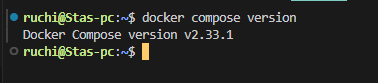
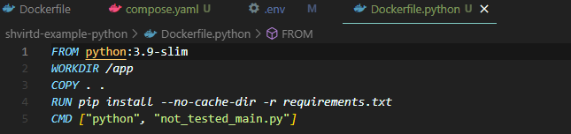
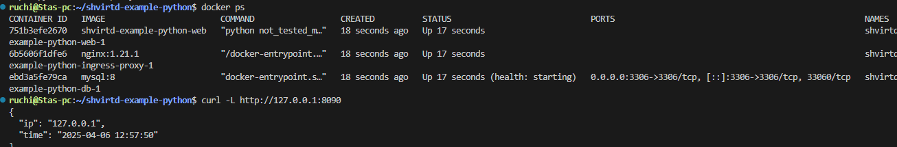
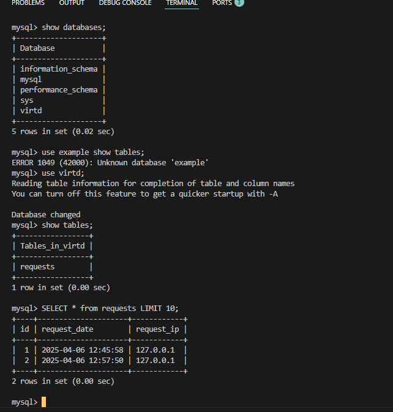
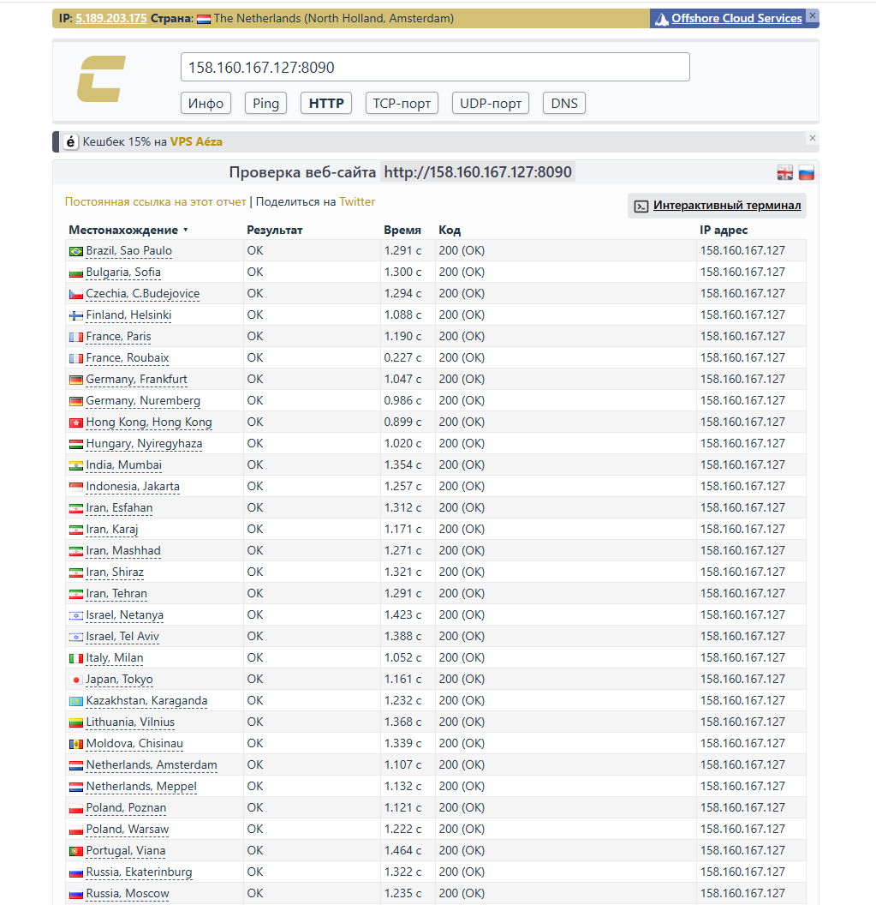
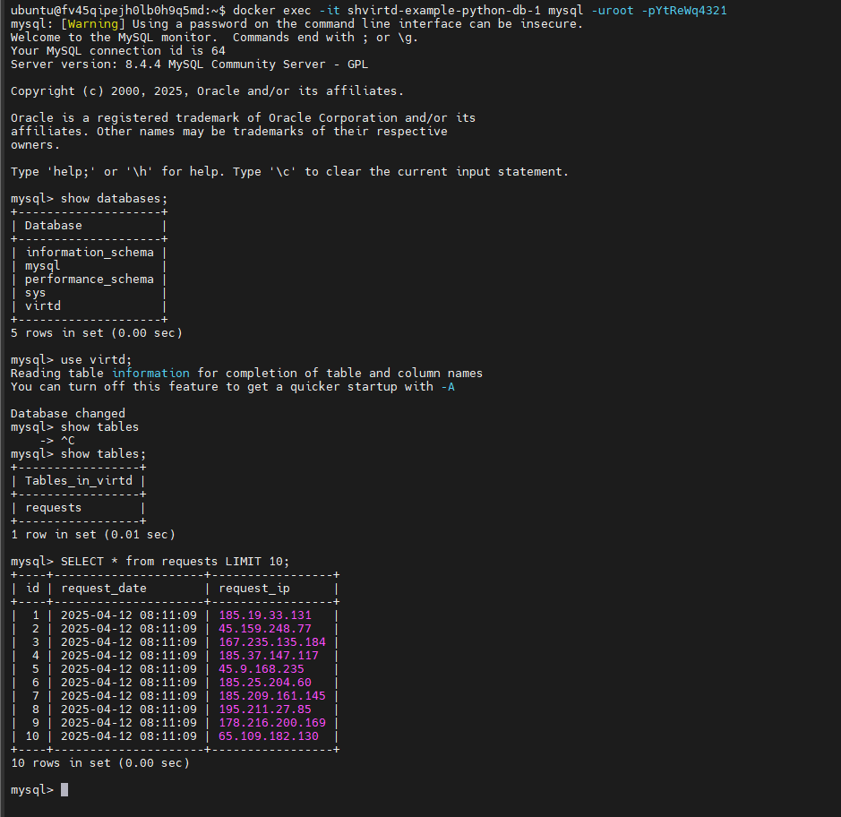
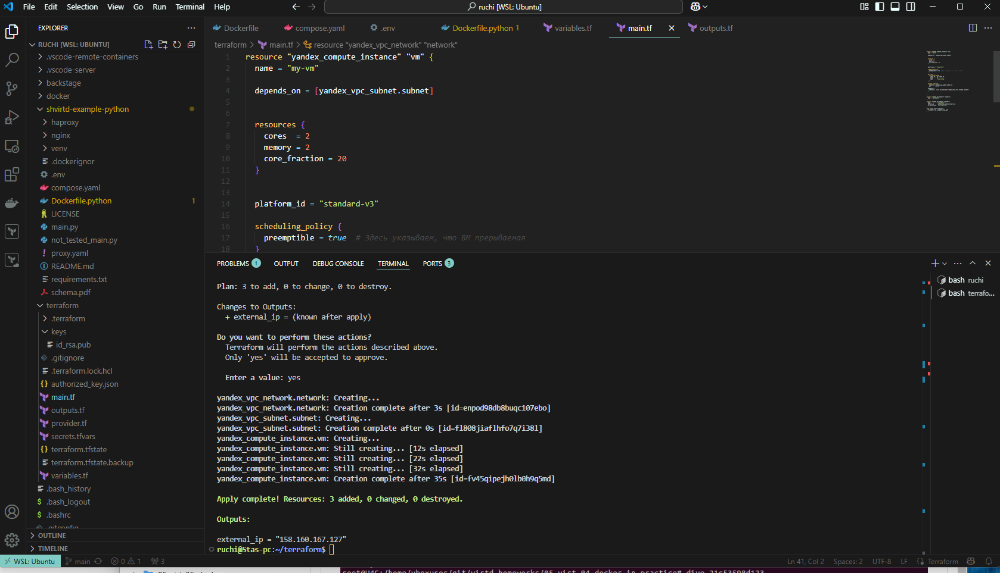

#### Задача 0.



#### Задача 1.



#### Задача 3.




#### Задача 4.

```
!/bin/bash
sudo apt update && sudo apt install git -y
cd /opt
sudo git clone "https://github.com/ruchimsky/shvirtd-example-python"
cd shvirtd-example-python
sudo chmod 666 /var/run/docker.sock
docker compose up -d
```




#### Задача 6.
Можете принять это за решение? я уже создаю виртуалки на yandex cloud через terraform

