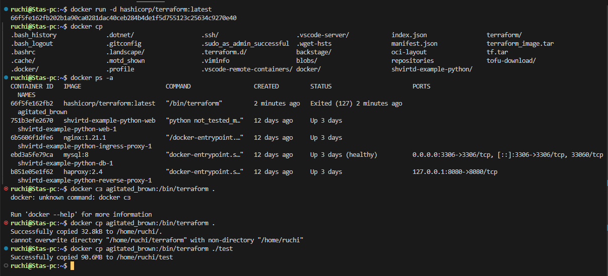

#### Задача 0.


#### Задача 1.


#### Задача 3.


#### Задача 4.

```
!/bin/bash
sudo apt update && sudo apt install git -y
cd /opt
sudo git clone "https://github.com/ruchimsky/shvirtd-example-python"
cd shvirtd-example-python
sudo chmod 666 /var/run/docker.sock
docker compose up -d
```


#### Задача 6.


#### Задача 6.1

