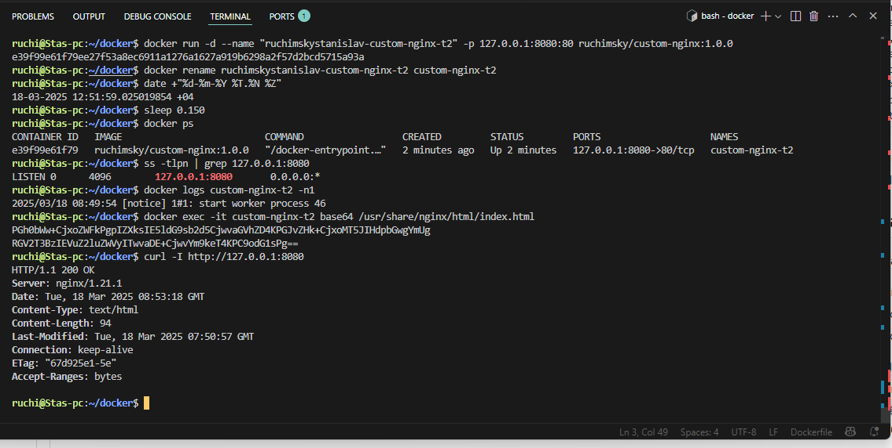
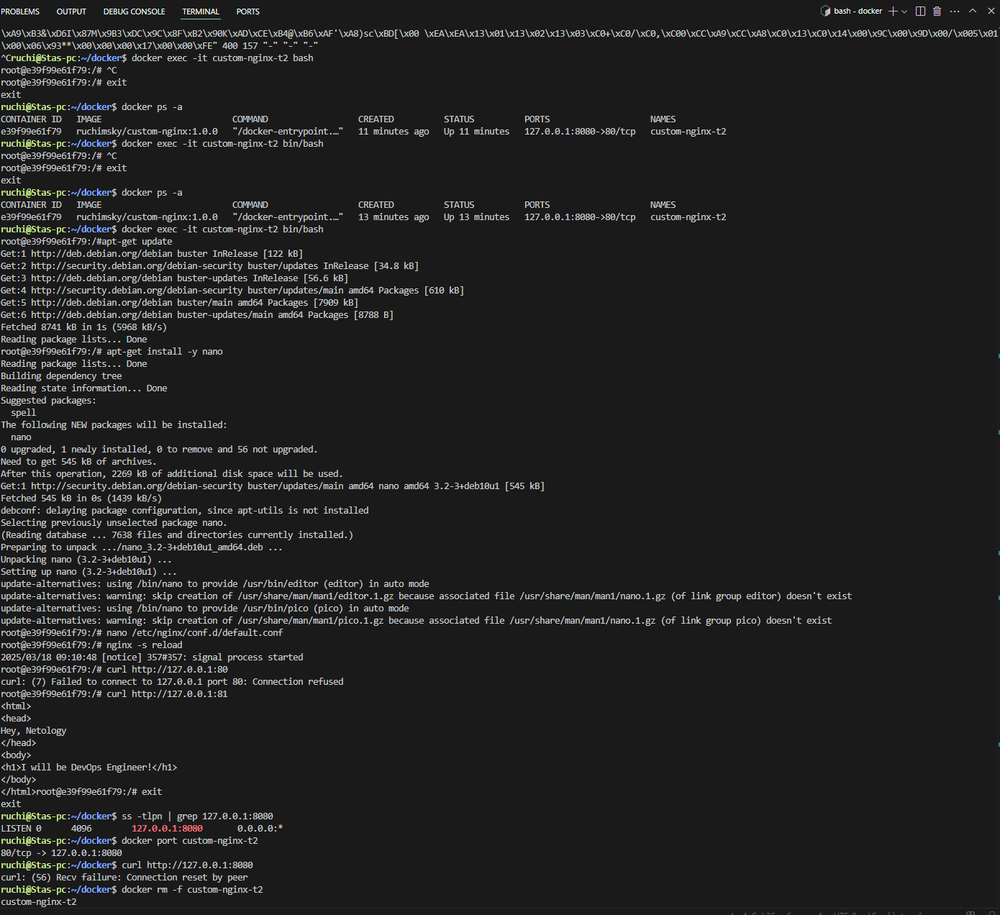
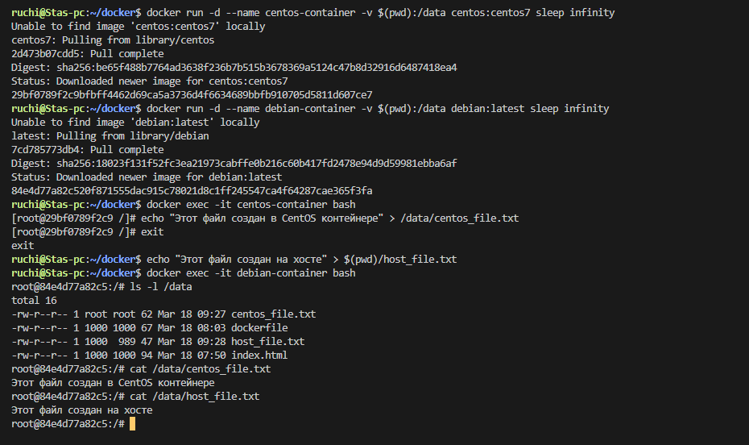
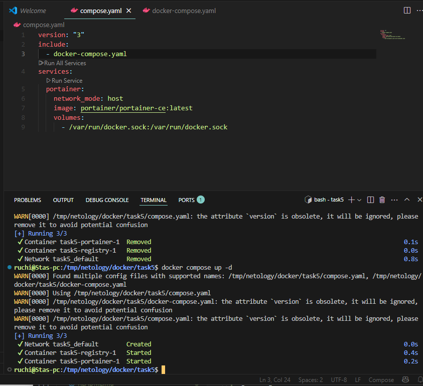
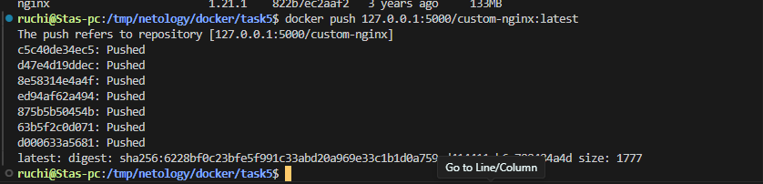
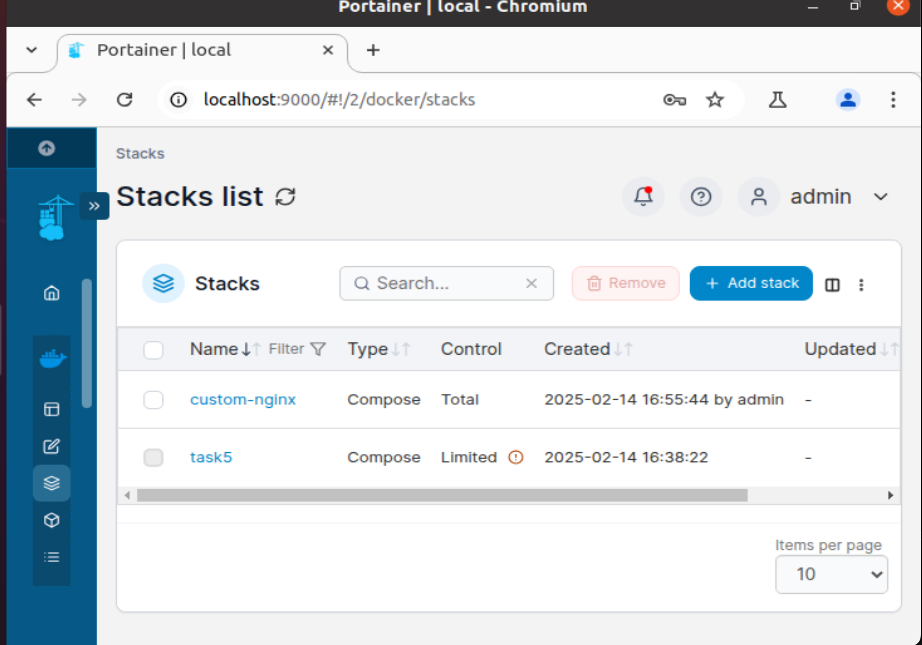
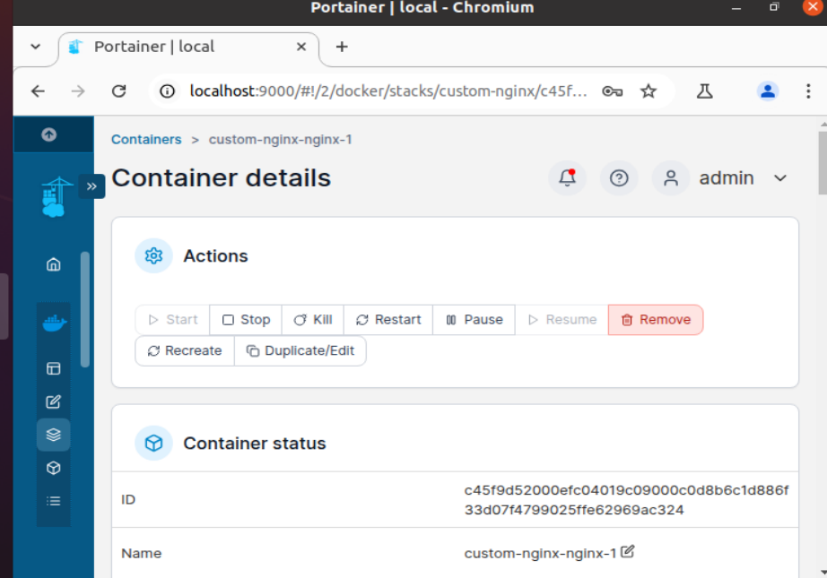
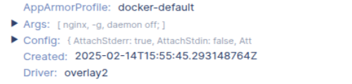
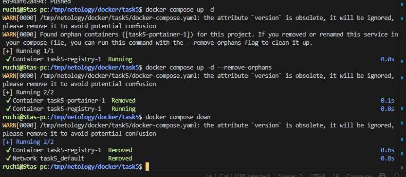

Задача 1. https://hub.docker.com/repository/docker/ruchimsky/custom-nginx/general
Задача 2. 
Задача 3. 
2./3.Подключитесь к контейнеру и нажмите комбинацию Ctrl-C.
Выполните docker ps -a и объясните своими словами почему контейнер остановился.
с чего это ему останавливаться?
10. Если curl http://127.0.0.1:8080 не работает, значит Nginx теперь слушает порт 81, а внешний порт остался 8080 → 80.

Задача 4. 

Задача 5.
1. Запущен compose.yaml потому что в новых версиях compose.yaml это стандарт и у него приоритет
2. 
3. 
4. 
5. 
6. 
7. 
orphan containers означает, что существуют контейнеры-сироты, которые до этого были частью compose-проекта, но теперь отсутствуют в compose.yaml (docker-compose.yaml). С помощью флага мы удалили такие контейнеры автоматически --remove-orphans